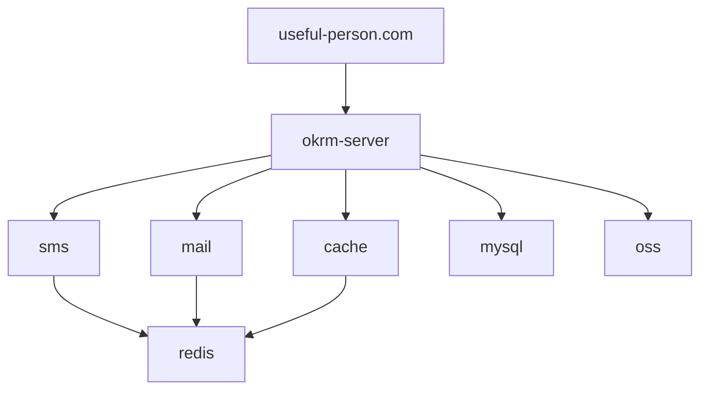

# okrm-server

## 介绍

okrm-server基于spring全家桶开发。

## 软件架构




## 安装教程

### 数据库密码加密

```shell
# 加密
mvn jasypt:encrypt-value -Djasypt.encryptor.password="密钥" -Djasypt.plugin.value="密码明文"
# 如果使用src/main/resources/application.properties的配置来加密，可以执行下面的命令，不支持yml
mvn jasypt:encrypt -Djasypt.encryptor.password="the password"
# 解密
mvn jasypt:decrypt-value -Djasypt.encryptor.password="密钥" -Djasypt.plugin.value="密文"
```
也可以直接使用jar包进行加解密

```shell
java -cp jasypt-1.9.2.jar org.jasypt.intf.cli.JasyptPBEStringEncryptionCLI input="root" password=security algorithm=PBEWithMD5AndDES

java -cp jasypt-1.9.2.jar org.jasypt.intf.cli.JasyptPBEStringDecryptionCLI input="i00VogiiZ1FpZR9McY7XNw==" password=security algorithm=PBEWithMD5AndD
```


### MySQL

使用root用户使用utf8mb4字符集创建okrm库，创建用户名okrm密码okrm_password授权dba、数据库okrm，

使用okrm-core/src/main/resources/sql中的sql初始化持续登录的表和用户连接信息的表

### Redis

在项目根目录使用docker-compose启动redis

```shell
docker-compose up -d
docker-compose stop
docker-compose restart
docker-compose rm
```

### 服务器目录结构

```
# okrm-server
/home/okrm
/home/okrm/goaloneService.sh
/home/okrm/servicespace
/home/okrm/okrm-server
# useful-person.com
/home/okrm/www/useful-person.com
```

### nginx配置

```
location / {
    root /home/okrm/www/useful-person.com;
    index index.html index.htm;
}
location /api/ {
    proxy_pass http://127.0.0.1:8081/;
    # 获取客户端真实ip $host 变量，Host 为变量名
    proxy_set_header   Host             $host;
    proxy_set_header   X-Real-IP        $remote_addr;
    proxy_set_header   X-Forwarded-For  $proxy_add_x_forwarded_for;
}
```

### 证书配置


### 部署脚本

这个脚本还有很大的修改空间，可以从文件中读取配置文件

```shell
#!/bin/sh
username=okrm
remote_id=121.40.244.200
remote_dir=/home/okrm/servicespace/okrm-server
fileName=useful-person.okrm-server-0.0.1-SNAPSHOT.jar
time=$(date "+%Y-%m-%d_%H:%M:%S")
logFile=deploy_${time}.log
bakFile=${fileName}.${time}
logFn() {
    echo "$(date "+%Y-%m-%d %H:%M:%S") $1" >> ${logFile}
}
# 构建
logFn "构建"
mvn clean install package -Dmaven.test.skip=true -Pprod
logFn "备份"
ssh ${username}@${remote_id} > /dev/null 2>&1 << EOF
sh /home/okrm/goaloneService.sh okrm-server clean
exit
EOF

# 拷贝文件
logFn "发布"
scp useful-person.okrm-server/target/${fileName} okrm@okrm:${remote_dir}/${fileName}

logFn "启动"
ssh ${username}@${remote_id} > /dev/null 2>&1 << EOF
sh /home/okrm/goaloneService.sh okrm-server prod start
exit
EOF
echo done!
```

### 启动脚本

goaloneService.sh

```shell
#!/bin/sh
## java env
#export JRE_HOME=${JAVA_HOME}
## exec shell name
EXEC_SHELL_NAME=$1\.sh
## service name
SERVICE_NAME=$1
ENV=$2
SERVICE_DIR=/home/okrm
JAR_NAME=useful-person.okrm-server-0.0.1-SNAPSHOT.jar
TIME_STR=$(date +%Y%m%d%H%M%S)
PID=pid/$SERVICE_NAME\.pid
WORK_DIR=$SERVICE_DIR/servicespace/$1
#function start
start(){
   cd $WORK_DIR
   if [ ! -d "log" ]; then
        mkdir log
   fi
   nohup /usr/java/jdk-13.0.1/bin/java -Xms256m -Xmx512m -jar $WORK_DIR/$JAR_NAME --spring.profiles.active=$ENV > log/$SERVICE_NAME.out 2>&1 &
        echo $! > $PID
        echo "**************** start $SERVICE_NAME success ****************"
}
# function stop
stop() {
    cd $WORK_DIR
    if [ -f "$PID" ]; then
        kill  `cat $PID`
        rm -rf $PID
    fi
    echo "**************** stop $SERVICE_NAME ****************"
    sleep 6
    TEMP_PID=`ps -ef | grep -w "$SERVICE_NAME" | grep "java" | awk '{print $2}'`

    if [ "$TEMP_PID" =  "" ]; then
        echo "**************** $SERVICE_NAME process not exists or stop success ****************"
    else
        echo "**************** $SERVICE_NAME process pid is [$TEMP_PID] ****************"
        kill -9 $TEMP_PID
    fi
    echo "**************** stop $SERVICE_NAME success ****************"
}
# function clean
clean(){
    cd $WORK_DIR
    if [ ! -d "lastDeploy" ]; then
        mkdir lastDeploy
    fi
    if [ -f "$JAR_NAME" ]; then
        mv $JAR_NAME lastDeploy/$JAR_NAME$TIME_STR
    fi
}
case "$2" in
    start)
        start
    ;;

    stop)
        stop
    ;;

    restart)
        stop
        sleep 2
        start
        echo "**************** restart $SERVICE_NAME success ****************"
    ;;

    clean)
        stop
        sleep 2
        clean
        echo "**************** clean $SERVICE_NAME success ****************"
    ;;

    *)
        ## restart
        stop
        sleep 2
        start
        ;;
esac
exit 0

```


## 使用说明

安装IDE，修改IDE编码格式为UTF-8

安装mysql 8.x

运行redis

安装docker

docker pull redis

docker run --name okrm-redis -d redis

或者直接下载redis

make

make test

make install

make test

./src/redis-server

新建mysql用户okrm并给它赋予权限

安装lombok

maven构建

maven构建

```shell
mvn clean install package -Dmaven.test.skip=true -Pprod
```


# jenkins

## jenkins升级（一般不需要操作）

```shell
# 下载
wget -O /usr/lib/jenkins/jenkins_2.237.war http://mirror.serverion.com/jenkins/war/2.237/jenkins.war
#  curl http://updates.jenkins-ci.org/download/war/2.209/jenkins.war jenkins_2.209.war
# 停止服务
service jenkins stop

# 替换文件
cp /usr/lib/jenkins/jenkins_2.237.war /usr/lib/jenkins/jenkins.war

# 启动服务
service jenkins start
```

